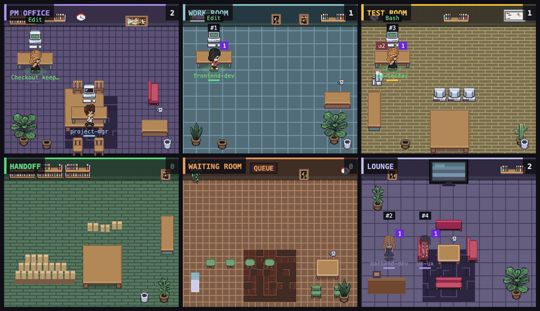
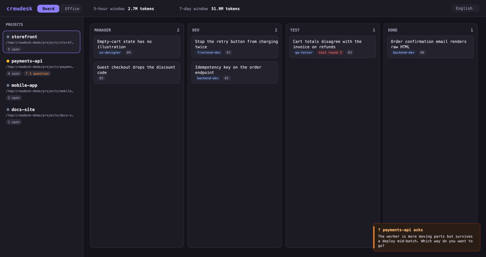

<h1 align="center">crewdesk</h1>

<p align="center">
  <b>A local dashboard for Claude Code — every project, every agent, what stage the work is in, and how much of your token window is left.</b>
</p>

<p align="center">
  <a href="#install">Install</a> ·
  <a href="#what-it-shows">What it shows</a> ·
  <a href="#how-it-works">How it works</a> ·
  <a href="#faq">FAQ</a> ·
  <a href="#privacy">Privacy</a>
</p>

<p align="center">
  
  
  
</p>

<p align="center">
  
</p>

---

You have Claude Code running in four repos at once. One of them is waiting on an answer you never saw. Another burned half your weekly token budget an hour ago. A third finished twenty minutes ago and has been idle since.

**crewdesk** reads Claude Code's own local files and puts all of it on one screen: a project sidebar, a stage board you can move work across, a pixel-art office where your agents actually move between rooms, and rolling token windows across the top.

No account. No API key. No telemetry. Nothing leaves your machine — it is a read-only view over `~/.claude`.

## Install

Requires **Node.js 20+** and [Claude Code](https://claude.com/claude-code) installed.

```bash
npx crewdesk
```

Then open **http://127.0.0.1:4600**. That's it — no config file, no setup wizard.

Want to see it full before pointing it at your own work? `npm run demo` builds a throwaway
`~/.claude` tree of invented projects under your temp directory and serves that instead —
your real data is never read. Every screenshot on this page is that demo.

Global install, if you'd rather have the command around:

```bash
npm install --global crewdesk
crewdesk
```

From source:

```bash
git clone https://github.com/mhmmdglc/crewdesk.git
cd crewdesk
node bin/crewdesk.mjs --port 4600
```

### Options

| Flag | Default | Meaning |
|---|---|---|
| `--port`, `-p` | `4600` | Port to listen on |
| `--host` | `127.0.0.1` | Interface to bind. Loopback by default — read [Privacy](#privacy) before changing it |
| `--help`, `-h` | | Print usage |

## What it shows

### Projects sidebar

Every project Claude Code has touched in the last 7 days, newest activity first. Each row shows a live status dot (running / waiting on you / idle), how many work items are open, how many sessions are active, and whether a chat is waiting for your answer.

### Board tab



Work items in four columns — **Manager → Dev → Test → Done**. Click a stage to move a card; pick an owner from the dropdown to assign it to one of that project's agents.

Moving a card *backwards out of Test* increments its test-round counter, so a card that has bounced twice wears a `↺2` badge. That single number answers a question a plain kanban never can: *is this thing actually converging?*

### Office tab


The same state as a pixel-art office, except here **characters are agents, not tasks**, and each room means something specific:

| Room | Who is in it |
|---|---|
| **PM office** | The orchestrating session, and any agent whose role reads as a manager |
| **Work room** | Agents that are *running right now* — their monitor animates while they work |
| **Test room** | The same, for QA-shaped roles |
| **Handoff room** | Agents that just delivered something, for a few minutes after |
| **Waiting room** | Sessions blocked on **you** — an answer, a permission, a decision |
| **Lounge** | Idle agents. A backlog is not work: an agent with a queue but no running process waits here, with its load on its shoulder |

Above an agent's head is the task in hand. On its shoulder is the queue length. Under its name is its role colour, read from your own agent definitions.

**The rooms tell the truth.** An empty work room means nothing is running, even if ten items are assigned. That is the point — a dashboard that flatters you is worse than no dashboard.

### Token windows

Rolling **5-hour** and **7-day** token consumption, summed from Claude Code's own hourly buckets, with per-session attribution. When Claude Code publishes official limit gauges, they render as progress bars beside the raw numbers.

### Question alerts

When a chat is genuinely waiting on you, crewdesk raises a card and, if you allow it, a desktop notification. It distinguishes *"Claude asked you a question"* from *"Claude finished its turn"* — only the first interrupts you. Mark one read, mark all read, or collapse the stack to a bell. Read marks are keyed to the chat's last message, so a **new** question from the same chat alerts again.

## How it works

Everything is read from Claude Code's local state. crewdesk never writes to it.

| Source | Used for |
|---|---|
| `~/.claude/projects/<project>/*.jsonl` | projects, sessions, git branch, current tool, sub-agents, activity age, waiting-for-you detection |
| `~/.claude/tasks/<sessionId>/*.json` | work items — id, subject, status |
| `~/.claude/session-monitor/token-buckets.json` | hourly token buckets → 5-hour and 7-day windows, per-session attribution |
| `~/.claude/session-monitor/official-usage.json` | official limit gauges, when populated |
| `<project>/.claude/agents/*.md` | that project's own agent roster: name, colour, role |

Transcripts are read from the tail only (last 256 KB per session), so multi-hundred-megabyte session files cost nothing.

crewdesk writes exactly two files of its own, both under `~/.crewdesk/`:

- **`events.jsonl`** — the handoff log. One append-only line per `assigned` / `started` / `delivered` / `returned` / `done`. Queues, rooms, test rounds and cycle times are all *derived* from it, never stored. Position is a consequence of history, not a field someone forgot to update.
- **`overlay.json`** — stage and owner per task, keyed by `sessionId:taskId`.

Delete either file and you are back to state derived purely from Claude Code's own data.

### Why an overlay instead of writing back to Claude Code

Claude Code tasks have three states: `pending`, `in_progress`, `completed`. A delivery pipeline has more: something can be *done by the developer but sitting in test*, or *back from test for the second time*. Rather than overload the native status field — or worse, mutate Claude Code's files — crewdesk keeps process state beside it. Native status still drives the default column, so a fresh install is already correct.

## API

crewdesk is a plain HTTP server; the UI is just its first client.

```http
GET  /api/state     # the whole board as JSON
GET  /api/events    # the raw handoff log
GET  /api/health
POST /api/stage     # { "key": "<sessionId>:<taskId>", "stage": "manager|dev|test|done" }
POST /api/assign    # { "key": "...", "agent": "qa-reviewer", "event": "assigned" }
```

Assign a task from a script, a hook, or another agent:

```bash
curl -X POST http://127.0.0.1:4600/api/assign \
  -H 'content-type: application/json' \
  -d '{"key":"<sessionId>:3","agent":"qa-reviewer","event":"delivered"}'
```

## FAQ

**Does this send my code or prompts anywhere?**
No. There is no outbound network call in the process. It binds to loopback, reads local files, and serves a page. See [Privacy](#privacy).

**Do I need to configure my projects?**
No. Any project Claude Code has touched shows up automatically. Projects that define agents in `.claude/agents/*.md` get a full crew; projects that don't show the session itself as the single person working.

**Why is my work room empty when I have tasks assigned?**
Because nothing is running. Assignment is not execution. Idle agents wait in the lounge with their queue on their shoulder.

**Why does an agent disappear between tasks?**
Claude Code sub-agents are ephemeral — they exist only while running. crewdesk draws *roles* from your agent definitions, so the character stays on screen and simply stops glowing.

**Can I use it with something other than Claude Code?**
Not yet. The reader is isolated in `src/sources.mjs`; any tool that keeps local JSONL transcripts could be added there.

**It says a chat is waiting for me, but it isn't.**
Question detection is heuristic — it looks for a question mark or an asking pattern in the last turn. False positives are possible; dismiss them with `×`. Hooking Claude Code's `Notification` event is on the roadmap and will make it exact.

**Does it work on Windows and Linux?**
It only assumes `~/.claude` exists and Node 20+. Developed on macOS; reports from other platforms are welcome.

## Privacy

- Binds to `127.0.0.1` by default. Passing `--host 0.0.0.0` exposes your task subjects, chat excerpts and project paths to your whole network — only do that on a network you trust.
- Reads `~/.claude` **read-only**. It never modifies Claude Code's files.
- Writes only to `~/.crewdesk/`.
- No analytics, no crash reporting, no auto-update, no outbound requests, zero runtime dependencies.

## Roadmap

- [ ] Infer assignment automatically from `Agent` tool calls and `SubagentStop`
- [ ] Drag and drop between columns
- [ ] Per-project stage configuration — not every team has the same four stages
- [ ] Cycle time and bottleneck stats from the handoff log
- [ ] Cost estimate per project from token buckets
- [ ] Optional hook mode for sub-second updates instead of 4s polling
- [ ] Support other agent CLIs that keep local transcripts
- [x] Demo mode with fabricated data (`npm run demo`)
- [x] UI in English, Turkish, Spanish, Chinese, Japanese and German

## Contributing

Issues and pull requests are welcome. The codebase is deliberately small and dependency-free:

```
bin/crewdesk.mjs     CLI entry
demo/seed.mjs        fabricated ~/.claude tree used by `npm run demo`
src/server.mjs       HTTP + API
src/sources.mjs      reads ~/.claude (projects, tasks, tokens, agent rosters)
src/events.mjs       handoff log + room derivation
src/board.mjs        stage/owner overlay
public/index.html    UI shell, board, alerts
public/office.js     canvas pixel office
```

Run `node --check` on changed files before opening a PR; there is no build step.

## Credits

Character sprites: **MetroCity — Free Topdown Character Pack** by [JIK-A-4](https://jik-a-4.itch.io/metrocity-free-topdown-character-pack), CC0 1.0.
Furniture, floor and carpet sprites: **[Pixel Agents](https://github.com/pixel-agents-hq/pixel-agents)** by Pablo De Lucca, MIT — full notice in [LICENSE-THIRD-PARTY.md](LICENSE-THIRD-PARTY.md).
The TV, delivery boxes and badges are drawn procedurally in `public/office.js`.

If you want your agents rendered as characters walking around a customisable office, go look at Pixel Agents — it does that better. crewdesk answers a different question: *what stage is the work in, and who is blocked?*

## License

[MIT](LICENSE)
